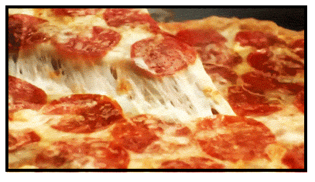

```{r setup, include=FALSE}
knitr::opts_chunk$set(echo = FALSE, warning = FALSE, message = FALSE)

library(tidyverse)
library(knitr)

```

Here's my website.

```{r fig.align='center', fig.width=5,fig.height=5}

knitr::include_graphics("./media/chickenwing.jpeg")

```

# adding a gif

```{r}

```


## Here's some links

 [About me](https://jaredlundrigan.github.io/aboutme/)
 
 [My CV](https://jaredlundrigan.github.io/aboutme/CV.pdf)
 
 
 
 
 
 
